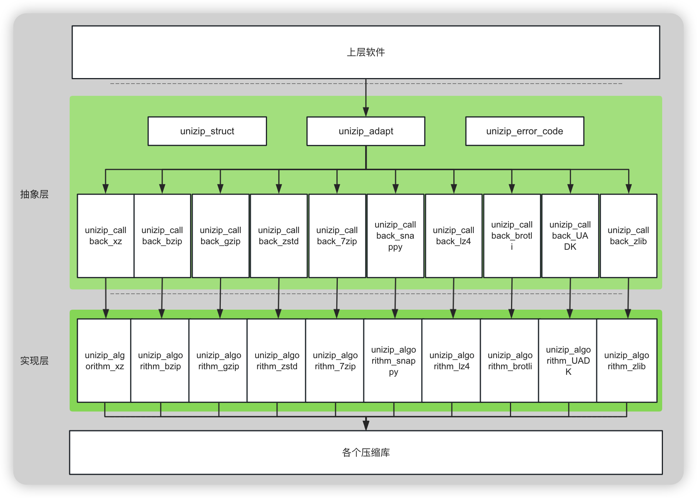

# README

# unizip

#### 介绍

本项目基于 openEuler 社区提供统一的压缩库，基于该压缩库能够实现对于不同压缩软件的适配，无需修改开源软件代码即可灵活切换开源软件使用不同的压缩算法。

#### 软件架构



  详细设计见 wiki

#### 安装教程

1. 执行如下命令安装 gmock-devel、cmake、make、zlib-devel、LibLZMA、BZip2、Zstd、Snappy、Brotli、lz4

```
yum install -y gmock-devel cmake make gcc-c++ bzip2-devel zlib-devel xz-devel libzstd-devel snappy-devel brotli-devel lz4-devel
```

2. 使用如下命令 clone 代码

```
git clone https://gitee.com/openeuler/unizip.git
```

3. 进入 unizip 目录，执行如下命令进行编译

```
sudo mkdir build
cd build
cmake ..
make
```

4. 执行如下命令运行测试用例：

```
ctest
```

5. 执行如下命令生成覆盖率报告：

```
make coverage
```

6. 执行如下命令安装：

```
make install
```

#### 使用教程

开源软件可以使用unizip替代zlib库使用，修改需要修改的内容如下（以curl为例）

1、修改开源代码的编译参数配置文件，根据不同的开源软件编译方式修改不同的文件，例如configure.ac或者CMakeLists.txt等。 以curl为例，修改configure.ac，增加如下内容，通过参数--with-unizip控制是否使用unizip：

```
AC_ARG_WITH([unizip],
    [AS_HELP_STRING([--with-unizip], [Enable UNIZIP (default is no)])],
    [use_unizip="$withval"],
    [use_unizip="no"])

if test "x$use_unizip" = "xyes"; then
    AC_MSG_WARN([UNIZIP is enabled.])
    PKG_CHECK_MODULES([UNIZIP], [unizip],
        [LIBS="-lunizip $LIBS"
        AC_DEFINE([USE_UNIZIP], [1], [Define if UNIZIP is enabled])],
        [
        AC_MSG_ERROR([Could not find UNIZIP library])
        ])
fi
```

2、查找源码文件中所有使用到zlib.h的位置，将源代码中的 zlib.h 更换成 unizip_adapt.h，并对结构体进行重命名，以curl为例：

例如将 content_encoding.c 文件中的

```cpp
#ifdef HAVE_ZLIB_H
#include <zlib.h>
#endif
```

更换成

```cpp
#ifndef USE_UNIZIP						// 根据configure.ac中是否传入--with-unizip来确定是否使用unizip
#ifdef HAVE_ZLIB_H
#include <zlib.h>
#endif
#else
#include "unizip_adapt.h"
#define z_stream_s unizip_stream_s		// 重命名结构体
#define z_stream unizip_stream			// 重命名结构体
#define z_streamp unizip_streamp		// 重命名结构体
#endif
```

3、修改开源软件的编译脚本，在configure中添加--with-unizip，开启使用unizip替代zlib。以curl.spec为例：

```cpp
common_configure_opts="--cache-file=../config.cache \
         --enable-ldap \
         --enable-ldaps \
         --enable-manual \
-        --with-brotli \
         --with-libidn2 \
         --with-libpsl \
+        --with-libssh \
+        --with-unizip		# 开启使用unizip
```

#### 参与贡献

1. Fork 本仓库
2. 新建 Feat_xxx 分支
3. 提交代码
4. 新建 Pull Request
